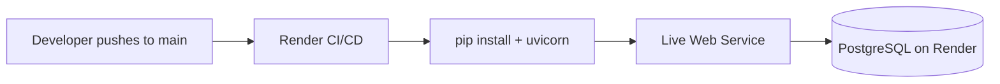
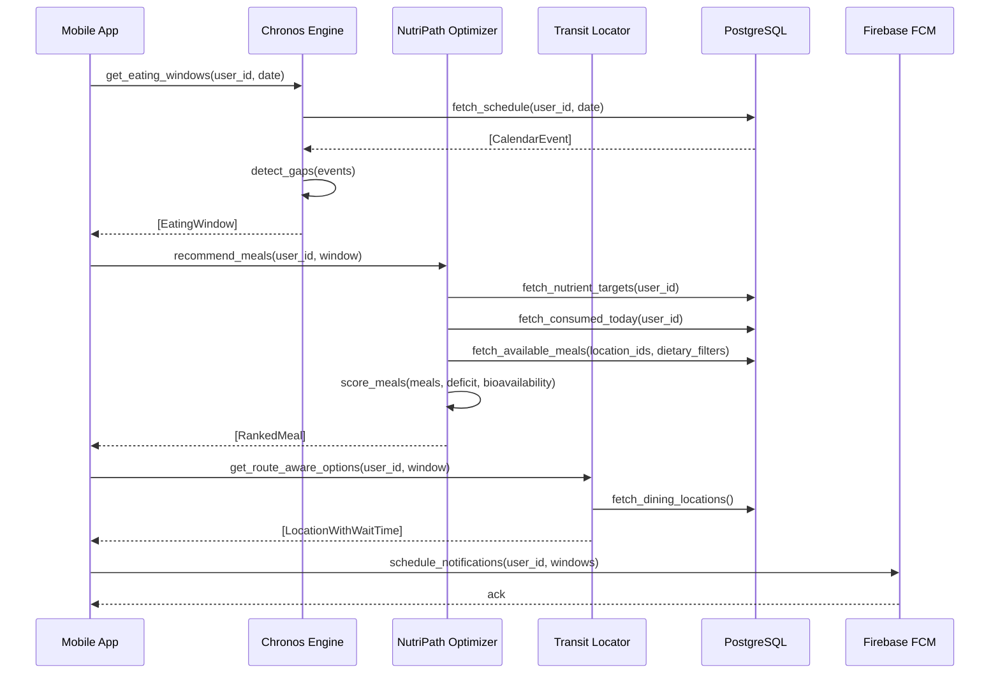

# Design Document: Campus Eats

---

## Global Design Constraints (Critical Invariants)

These three constraints are non-negotiable and apply to every layer of the system — backend, frontend, scoring engine, and data model.

### 1. Dietary Preference Logic — OR, Not AND

Lifestyle diets (`vegan`, `pescatarian`, `vegetarian`, etc.) must be treated as **OR logic**, not AND.

- A meal is valid if it satisfies **at least one** preference filter.
- The system must **never** attempt to satisfy mutually exclusive diets simultaneously (e.g. `vegan AND pescatarian`).
- Hard filters (allergies/religious) remain AND logic — they are never relaxed.

```python
# Correct behavior
if user.preference_filters:
    assert any(_meal_satisfies(meal, f) for f in user.preference_filters)
```

### 2. Nutrient-Agnostic Scoring (No Hardcoding)

The system must **never hardcode a specific nutrient** (e.g. iron) in scoring, logging, or UI logic.

All operations must iterate over `user.nutrient_focus: list[str]`. Any nutrient in the user profile must be:
- Scorable (weighted in `score_meals`)
- Displayable (rendered in Nutrient Pulse)
- Loggable (stored in `meal_logs.nutrients_json`)
- Included in deficit calculation (`calculate_nutrient_deficit`)

### 3. Security & Abuse Resistance Is First-Class

All endpoints and algorithms must be resilient against:
- Injection attacks (SQL, JSONB payload)
- Enumeration attacks (username, user ID)
- Race conditions (concurrent registration, duplicate log)
- Replay attacks (JWT `jti` revocation)
- Resource exhaustion / DoS (meal scoring complexity, payload size limits)

Security constraints are part of correctness, not optional enhancements.

---

## Overview

Campus Eats is a mobile-first meal scheduling and nutrition engine that eliminates decision fatigue for college students. It cross-references a student's academic schedule, physical location, and nutritional goals to surface real-time, route-aware dining recommendations with bioavailability-intelligent meal suggestions.

---

## Infrastructure

### Backend Hosting — Render

The Campus Eats backend and database are hosted on [Render](https://render.com).

- **Web Service**: Python/FastAPI application deployed as a Render Web Service (auto-deploys from `main` branch via GitHub integration)
- **Database**: Render-managed PostgreSQL instance (persistent disk, automatic daily backups)
- **Environment Variables**: Stored as Render environment secrets — `DATABASE_URL`, `JWT_SECRET`, `BCRYPT_ROUNDS`
- **Region**: Oregon (US West) — closest to University of Washington

```
Render Services
├── campus-eats-api        (Web Service — FastAPI)
│   └── PORT 8000, auto-scaled
└── campus-eats-db         (PostgreSQL 15)
    └── Internal connection string injected via DATABASE_URL
```

**Deployment flow:**



---

## University Scope

### v1: University of Washington Only

Campus Eats v1 is scoped exclusively to the **University of Washington (Seattle campus)**. Multi-university support is deferred to a future release. The `university` field on user accounts is seeded with a single option: `"University of Washington"`.

### Available UW APIs (Not Yet Integrated — For Future Use)

Research into UW-provided APIs surfaces the following candidates for future integration:

| API | Description | Auth | Notes |
|-----|-------------|------|-------|
| **UW Dining Menu API** | Exposes daily menus, nutrition info, and allergen data for all UW dining halls (e.g. Husky Union Building, Willow Hall, etc.) | UW NetID OAuth / API key | Endpoint base: `https://dining.uw.edu` — menu data available per location per meal period |
| **UW Time Schedule API** | Course schedule data — building codes, room numbers, meeting times | Public (no auth for read) | Base: `https://www.washington.edu/students/timeschd/` — useful for mapping class locations to campus buildings |
| **UW Student Personal Services API (MyUW)** | Enrolled courses, academic calendar, personal schedule | UW OAuth 2.0 (NetID) | Requires UW app registration; returns enrolled course schedule per student |
| **UW Maps / Campus Map API** | Building locations, coordinates, accessibility routes | Public | GeoJSON data available at `https://maps.uw.edu`; building codes align with Time Schedule codes |
| **UW Academic Calendar** | Quarter start/end dates, holidays, finals week | Public (iCal / JSON feed) | Available at `https://www.washington.edu/students/reg/calendar.html` |

> These APIs are documented here for awareness and future sprint planning. No integration is implemented in v1. When integrated, UW NetID OAuth will be the primary identity bridge between Campus Eats accounts and UW systems.

---

## Authentication & User Management

### Overview

Campus Eats uses a username/password authentication system with bcrypt password hashing and JWT access tokens. There is no email verification in v1 — registration requires only a username, password, and university selection.

### Endpoints

#### `POST /auth/register`

Creates a new user account.

**Request body** (`RegisterRequest`):
```python
@dataclass
class RegisterRequest:
    username: str        # 3–30 chars, alphanumeric + underscores
    password: str        # min 8 chars (plaintext — hashed before storage)
    university: str      # must be a key in SUPPORTED_UNIVERSITIES (e.g. "uw_seattle")
```

**Processing:**
1. Validate `username` format and uniqueness (query DB)
2. Validate `password` length >= 10 and `zxcvbn(password).score >= 2`
3. Validate `university` is a key in `SUPPORTED_UNIVERSITIES`
4. Hash password: `bcrypt.hashpw(password.encode(), bcrypt.gensalt(rounds=12))`
5. Generate `user_id`: `str(uuid.uuid4())`
6. Insert row into `users` table — catch `UniqueViolationError` and return `409 Conflict`
7. Return `201 Created` with `AuthToken`

**Response** (`AuthToken`):
```python
@dataclass
class AuthToken:
    access_token: str    # signed JWT
    token_type: str      # always "bearer"
    expires_in: int      # seconds until expiry (default: 86400 — 24h)
```

---

#### `POST /auth/login`

Authenticates an existing user and returns a JWT.

**Request body** (`LoginRequest`):
```python
@dataclass
class LoginRequest:
    username: str
    password: str        # plaintext — compared against bcrypt hash
```

**Processing:**
1. Look up user by `username`
2. Always run `bcrypt.checkpw` — use `DUMMY_HASH` if user not found (prevents username enumeration)
3. If user not found or password mismatch → `401 Unauthorized`
4. Check account lockout: if `locked_until` is set and in the future → `401 Unauthorized`
5. On failed attempt: increment `failed_login_attempts`; if >= 5, set `locked_until = now() + 15 minutes`
6. Generate and sign JWT with `user_id`, `username`, `university`, `iat`, `nbf`, `exp`, `jti`
7. On success: reset `failed_login_attempts = 0`
8. Return `200 OK` with `AuthToken`

---

### Data Types / Interfaces

```python
import uuid
import bcrypt
from dataclasses import dataclass
from datetime import datetime, timedelta
from typing import Literal


SUPPORTED_UNIVERSITIES: dict[str, str] = {
    "uw_seattle": "University of Washington",
}
# user.university stores the ID ("uw_seattle"), not the display name

DUMMY_HASH = b"$2b$12$C6UzMDM.H6dfI/f/IKcEeO5j9GqQ8K/uxkXn9Yx8RJWb1x1oGf4bW"
# Precomputed constant — NOT generated at import time.
# Rationale: bcrypt.hashpw at import time adds ~300ms startup cost and the reused
# hash is functionally equivalent for timing-safe comparison purposes.
# Replace this value with a freshly generated hash during initial deployment.


@dataclass
class RegisterRequest:
    username: str
    password: str
    university: str


@dataclass
class LoginRequest:
    username: str
    password: str


@dataclass
class AuthToken:
    access_token: str
    token_type: Literal["bearer"] = "bearer"
    expires_in: int = 86400          # 24 hours


@dataclass
class User:
    user_id: str                     # UUID v4, e.g. "550e8400-e29b-41d4-a716-446655440000"
    username: str
    password_hash: str               # bcrypt hash — NEVER the plaintext password
    university: str                  # stores university ID (e.g. "uw_seattle")
    created_at: datetime
    failed_login_attempts: int = 0
    locked_until: datetime = None
```

**PostgreSQL `users` table:**

```sql
CREATE TABLE users (
    user_id                UUID PRIMARY KEY DEFAULT gen_random_uuid(),
    username               VARCHAR(30) UNIQUE NOT NULL,
    password_hash          TEXT NOT NULL,
    university             VARCHAR(100) NOT NULL,
    created_at             TIMESTAMPTZ NOT NULL DEFAULT NOW(),
    failed_login_attempts  INTEGER NOT NULL DEFAULT 0,
    locked_until           TIMESTAMPTZ
);
```

---

### JWT Middleware

All protected routes require a valid `Authorization: Bearer <token>` header.

```python
# JWT payload structure
{
    "sub": "550e8400-e29b-41d4-a716-446655440000",  # user_id
    "username": "husky_dan",
    "university": "uw_seattle",
    "iat": 1720000000,                               # issued at (Unix timestamp)
    "nbf": 1720000000,                               # not before (same as iat)
    "exp": 1720086400,                               # Unix timestamp (iat + 86400)
    "jti": "a3f1c2d4-..."                            # unique token ID for revocation
}
```

Middleware behavior:
- Missing header → `401 Unauthorized`
- Expired token → `401 Unauthorized` (do not refresh automatically in v1)
- Invalid signature → `401 Unauthorized`
- `jti` not found in active sessions store → `401 Unauthorized` (token revoked)
- Valid token → inject `current_user` into request context

---

### Frontend — Create Account Page

Fields rendered on the registration form:

| Field | Type | Validation |
|-------|------|------------|
| Username | Text input | 3–30 chars, alphanumeric + underscores |
| Password | Password input | Min 10 chars |
| Confirm Password | Password input | Must match Password — **frontend-only, not sent to backend** |
| University | Dropdown | Seeded from `SUPPORTED_UNIVERSITIES`; defaults to "University of Washington" |

The `Confirm Password` field is validated client-side before the request is sent. It is never included in the `RegisterRequest` payload.

---

### Formal Specifications

#### `register(req: RegisterRequest) -> AuthToken`

**Preconditions:**
- `len(req.username) >= 3 and len(req.username) <= 30`
- `req.username` matches `^[a-zA-Z0-9_]+$`
- `len(req.password) >= 10 and zxcvbn(req.password).score >= 2`
- `req.university in SUPPORTED_UNIVERSITIES` (key check)
- No existing user with `username == req.username` in the database$`
- `len(req.password) >= 8`
- `req.university in SUPPORTED_UNIVERSITIES`
- No existing user with `username == req.username` in the database

**Postconditions:**
- A new `User` row exists in the database with a unique `user_id` (UUID v4)
- `stored_user.password_hash != req.password` (plaintext is never stored)
- `bcrypt.checkpw(req.password.encode(), stored_user.password_hash)` returns `True`
- Returns a valid `AuthToken` with a signed JWT
- JWT payload contains `sub == stored_user.user_id`
- If a concurrent registration with the same username occurs, `UniqueViolationError` is caught and `409 Conflict` is returned (not 500)

---

#### `login(req: LoginRequest) -> AuthToken`

**Preconditions:**
- `req.username` is a non-empty string
- `req.password` is a non-empty string

**Postconditions:**
- `bcrypt.checkpw` is always called — even if user not found (uses `DUMMY_HASH` to prevent timing-based username enumeration)
- If no user with `req.username` exists → raises `401 Unauthorized`
- If account is locked (`locked_until` is in the future) → raises `401 Unauthorized`
- If `bcrypt.checkpw(req.password, stored_hash)` is `False` → raises `401 Unauthorized`; increments `failed_login_attempts`; sets `locked_until` if attempts >= 5
- On success: returns `AuthToken` with JWT signed using server secret; resets `failed_login_attempts = 0`
- JWT `exp` claim is set to `now() + 86400 seconds`
- JWT includes `iat`, `nbf`, `jti` claims
- `jti` is stored in active sessions store
- Plaintext password is never logged or persisted at any point in the call

---

### Auth Correctness Properties

```python
# Auth Property 1: Passwords are never stored in plaintext
for user in db.query(User).all():
    assert not user.password_hash.startswith("$2b$") is False  # must be a bcrypt hash
    assert user.password_hash != any_known_plaintext_password

# Auth Property 2: Every user_id is a valid UUID v4 and globally unique
user_ids = [u.user_id for u in db.query(User).all()]
for uid in user_ids:
    assert uuid.UUID(uid, version=4)  # raises ValueError if invalid
assert len(user_ids) == len(set(user_ids))  # no duplicates

# Auth Property 3: JWT expiry is always enforced
decoded = jwt.decode(token, SECRET, algorithms=["HS256"])
assert decoded["exp"] > time.time()  # expired tokens are rejected

# Auth Property 4: University is always a valid key in SUPPORTED_UNIVERSITIES
for user in db.query(User).all():
    assert user.university in SUPPORTED_UNIVERSITIES  # key check

# Auth Property 5: Confirm Password field never reaches the backend
# (structural — RegisterRequest has no confirm_password field)
assert not hasattr(RegisterRequest, "confirm_password")

# Auth Property 6: Login is constant-time regardless of whether username exists
# bcrypt.checkpw is always called (DUMMY_HASH used when user not found)
# No early exit before bcrypt comparison — prevents timing-based enumeration

# Auth Property 7: Username uniqueness is enforced at DB level
# UNIQUE constraint on users.username — concurrent registrations cannot produce duplicates
# Application catches UniqueViolationError and returns 409 Conflict (not 500)

# Auth Property 8: JWT includes iat, nbf, jti claims
decoded = jwt.decode(token, SECRET, algorithms=["HS256"])
assert "iat" in decoded and "nbf" in decoded and "jti" in decoded

# Auth Property 9: Account lockout after 5 failed attempts
# After 5 consecutive failures, locked_until is set to now() + 15 minutes
# Login returns 401 while locked_until is in the future

# Auth Property 10: Password meets strength requirements
# len(password) >= 10 and zxcvbn(password).score >= 2
```

---

## Security

### Rate Limiting

- Login endpoint: max 5 requests/minute per IP, max 10 failed attempts/hour per username
- Register endpoint: max 3 requests/minute per IP
- Implementation: Redis-backed rate limiter or Render's built-in request throttling

### Account Lockout

After 5 consecutive failed login attempts, lock the account for 15 minutes.

```sql
ALTER TABLE users ADD COLUMN failed_login_attempts INTEGER NOT NULL DEFAULT 0;
ALTER TABLE users ADD COLUMN locked_until TIMESTAMPTZ;
```

- On successful login: reset `failed_login_attempts = 0`
- On failed login: increment `failed_login_attempts`; if >= 5, set `locked_until = NOW() + INTERVAL '15 minutes'`

### JWT Hardening

JWT payload must include `iat`, `nbf`, and `jti` claims:

```python
{
    "sub": user_id,
    "username": username,
    "university": university,
    "iat": now,
    "nbf": now,
    "exp": now + 86400,
    "jti": str(uuid.uuid4())  # unique token ID for revocation
}
```

Store active `jti` values in a `sessions` table or Redis set. On logout, invalidate the `jti`.

**Redis-backed session store (required):**

```python
# On login — store jti with TTL matching token expiry
redis.setex(f"jti:{jti}", 86400, "active")

# On logout — immediately invalidate
redis.delete(f"jti:{jti}")

# On JWT middleware validation
if not redis.exists(f"jti:{jti}"):
    raise HTTPException(401)  # token revoked or expired
```

TTL is set to exactly `exp - iat` (token lifetime in seconds). Redis handles eviction automatically — no manual cleanup required. This bounds memory usage to `O(active_sessions)` and prevents unbounded growth (DoS vector).

### Password Policy

Minimum requirements:
- Length >= 10 characters
- Must contain at least one uppercase, one lowercase, one digit
- Evaluated using zxcvbn score >= 2 (rejects "password123", "12345678", etc.)
- Register precondition: `len(req.password) >= 10 and zxcvbn(req.password).score >= 2`

### Username Enumeration Prevention

`login` must always run `bcrypt.checkpw` even if the user is not found (use a dummy hash). Response time must be constant regardless of whether username exists.

```python
DUMMY_HASH = b"$2b$12$C6UzMDM.H6dfI/f/IKcEeO5j9GqQ8K/uxkXn9Yx8RJWb1x1oGf4bW"
# Precomputed constant — avoids bcrypt cost at import time and prevents
# timing variance from a freshly generated hash on each cold start.

def login(req):
    user = db.get_user_by_username(req.username)
    hash_to_check = user.password_hash if user else DUMMY_HASH
    valid = bcrypt.checkpw(req.password.encode(), hash_to_check)
    # Always apply a small random jitter to prevent timing-based enumeration
    # even with constant-time bcrypt (lockout response timing can still leak)
    time.sleep(random.uniform(0.08, 0.12))
    if not user or not valid:
        raise HTTPException(401, detail="Invalid username or password")
        # Always return the same message — never "user not found" vs "wrong password"
```

### Authorization Layer

All protected endpoints must verify `user_id` from JWT matches the resource being accessed:

```python
# Precondition for all user-scoped endpoints:
assert current_user.user_id == resource.user_id  # or raise 403 Forbidden
```

### Input Sanitization

- All free-text fields (`likes`, `dislikes`, `pantry_items`, meal names) must be sanitized before storage and escaped on render
- Max lengths enforced: likes/dislikes items max 50 chars each, max 20 items per list; pantry items max 100 chars each, max 50 items
- JSONB payload size limit: `nutrients_json` max 64KB per row

### SQL Injection Prevention

- All DB queries MUST use parameterized queries or SQLAlchemy ORM
- Raw string interpolation into SQL is forbidden

### HTTPS Enforcement

- All API traffic must use HTTPS — HTTP requests rejected with 301 redirect
- Render enforces TLS by default; all endpoints are HTTPS-only

### Race Condition on Registration

- The `UNIQUE(username)` constraint handles concurrent registrations at DB level
- Application layer must catch `UniqueViolationError` and return `409 Conflict` (not 500)

### CSRF Protection (Future)

- If JWT is ever moved to cookies, implement CSRF tokens
- For v1 (Authorization header only), CSRF is not applicable

### JWT Secret Management

- `JWT_SECRET` must be a 256-bit (32-byte) random value
- Rotate every 90 days
- Never log or expose in error messages

### Idempotency for Meal Logging

Duplicate log prevention: if same `user_id` + `items` + `logged_at` (within 60-second window) is submitted twice, return the existing log entry rather than creating a duplicate.

```sql
-- Buckets by 60-second epoch floor — allows the same meal twice in a day,
-- but blocks double-taps and accidental re-submissions within the same minute.
CREATE UNIQUE INDEX meal_log_dedup ON meal_logs (
    user_id,
    floor(extract(epoch from logged_at) / 60)::bigint,
    md5(items::text)
);
```

### Notification Timing Fix

Never schedule a notification in the past:

```python
scheduled_time = max(datetime.now(tz=timezone.utc), window.start - timedelta(minutes=30))
```

### Timezone Normalization

- All `datetime` values must be timezone-aware (`datetime.now(tz=timezone.utc)`)
- All DB timestamps use `TIMESTAMPTZ`
- All comparisons must use UTC-normalized datetimes

---

## Main Algorithm / Workflow



## Core Interfaces / Types

```python
from dataclasses import dataclass, field
from enum import Enum
from typing import Optional
from datetime import datetime


class WindowType(str, Enum):
    GOLDEN = "golden"      # 45+ minutes — sit-down meal
    MICRO = "micro"        # 15–20 minutes — grab-and-go


class DietaryTag(str, Enum):
    VEGAN = "vegan"
    HALAL = "halal"
    KOSHER = "kosher"
    GLUTEN_FREE = "gluten-free"
    NUT_FREE = "nut-free"
    VEGETARIAN = "vegetarian"
    EGGITAREAN = "meat-free"
    PESCATARIAN = "only-seafood"
    POLLOTARIAN = "only-chicken"


# Meal dietary compliance is modeled via a capability/property set, not flat tag matching.
# This prevents logical contradictions (e.g. a meal incorrectly matching both "vegan" and "only-seafood").
#
# Each Meal carries a `properties: set[str]` field populated from the dining database.
# Filters are evaluated as predicates against these properties — not string equality.
#
# Example properties: "contains_fish", "contains_red_meat", "contains_dairy",
#                     "contains_eggs", "contains_gluten", "contains_nuts",
#                     "animal_product", "plant_based", "halal_certified", "kosher_certified"
#
# Filter predicate definitions:
DIETARY_PREDICATES: dict[str, Callable[[set[str]], bool]] = {
    "vegan":        lambda p: "animal_product" not in p,
    "vegetarian":   lambda p: "contains_red_meat" not in p and "contains_fish" not in p,
    "meat-free":    lambda p: "contains_red_meat" not in p,
    "only-seafood": lambda p: "contains_fish" in p and "contains_red_meat" not in p,
    "only-chicken": lambda p: "contains_poultry" in p and "contains_red_meat" not in p,
    "halal":        lambda p: "halal_certified" in p,
    "kosher":       lambda p: "kosher_certified" in p,
    "gluten-free":  lambda p: "contains_gluten" not in p,
    "nut-free":     lambda p: "contains_nuts" not in p,
}

def _meal_satisfies(meal: "Meal", filter_tag: str) -> bool:
    """
    Evaluates a dietary filter against a meal's capability properties.
    Uses predicate model — not tag string matching — to prevent logical contradictions.
    Returns True if the meal satisfies the filter; False otherwise.
    Unknown filter tags default to True (permissive — do not silently exclude meals).
    """
    predicate = DIETARY_PREDICATES.get(filter_tag)
    if predicate is None:
        return True  # unknown filter — permissive default
    return predicate(meal.properties)


@dataclass
class CalendarEvent:
    id: str
    title: str
    location_id: str          # campus building ID
    start: datetime
    end: datetime


@dataclass
class EatingWindow:
    start: datetime
    end: datetime
    duration_minutes: int
    window_type: WindowType
    preceding_event: Optional[CalendarEvent]
    following_event: Optional[CalendarEvent]


@dataclass
class NutrientProfile:
    values: dict[str, float]  # e.g. {"iron": 10.0, "protein": 30.0, "vitamin_d": 400.0}
    # Replaces hardcoded fields — nutrient-agnostic, extensible to any tracked nutrient


@dataclass
class Meal:
    id: str
    name: str
    location_id: str
    nutrients: NutrientProfile
    tags: list[DietaryTag]           # informational — used for display only
    properties: set[str]             # capability set — used for dietary filter evaluation
                                     # e.g. {"contains_fish", "halal_certified", "plant_based"}
    prep_time_minutes: int
    bioavailability_pairs: list[str] = field(default_factory=list)   # e.g. ["citrus"]
    bioavailability_inhibitors: list[str] = field(default_factory=list)  # e.g. ["calcium", "caffeine"]


@dataclass
class RankedMeal:
    meal: Meal
    score: float              # 0.0–1.0 composite nutrition + route score
    nutrient_gap_coverage: NutrientProfile
    route_detour_minutes: int


@dataclass
class UserProfile:
    user_id: str
    university_id: str
    hard_filters: list[str]           # AND logic — allergies/religious (e.g. "nut-free", "halal")
    preference_filters: list[str]     # OR logic — lifestyle diets (e.g. "vegan", "vegetarian")
    daily_targets: NutrientProfile
    nutrient_focus: list[str]         # list of nutrient names user cares about
    home_location_id: str             # dorm / default start point
```

## Key Functions with Formal Specifications

### `detect_gaps(events: list[CalendarEvent], buffer_minutes: float, day_start: datetime, day_end: datetime) -> list[EatingWindow]`

```python
def detect_gaps(
    events: list[CalendarEvent],
    buffer_minutes: float = 10,
    day_start: datetime = None,
    day_end: datetime = None
) -> list[EatingWindow]:
    ...
```

**Preconditions:**
- `events` is sorted ascending by `start`
- `buffer_minutes >= 0`
- All events have `end > start`
- All `datetime` values are timezone-aware (UTC)

**Postconditions:**
- Returns only windows where `duration_minutes >= 15` (minimum viable eating window)
- `window.window_type == GOLDEN` iff `duration_minutes >= 45`
- `window.window_type == MICRO` iff `15 <= duration_minutes < 45`
- No returned window overlaps with any event in `events`
- Morning gap (before first event) is included if `day_start` is provided and gap >= 15 minutes
- Evening gap (after last event) is included if `day_end` is provided and gap >= 15 minutes
- `duration_minutes` uses floor division (`int(...total_seconds() // 60)`) to avoid float truncation
- `len(result) >= 0` (empty list is valid — no gaps today)

**Loop Invariant:**
- At each iteration `i`, all gaps between `events[0..i-1]` have been evaluated and appended if valid

---

### `score_meals(meals: list[Meal], deficit: NutrientProfile, user: UserProfile, window: EatingWindow) -> list[RankedMeal]`

```python
def score_meals(
    meals: list[Meal],
    deficit: NutrientProfile,
    user: UserProfile,
    window: EatingWindow
) -> list[RankedMeal]:
    ...
```

**Preconditions:**
- `meals` is non-empty (if `apply_dietary_filters` returns empty, do NOT call `score_meals` — return `NoMealsAvailable` instead)
- `len(meals) <= 200` — hard cap enforced before calling; caller must pre-filter by location/time window
- All meals in `meals` have already passed dietary filter (no allergen violations)
- `deficit.values` contains only non-negative floats (represents remaining daily targets)
- `window` is a valid `EatingWindow` (used for academic intensity modifier)

**Postconditions:**
- Returns list of same length as `meals`
- Result is sorted descending by `score`
- `score` is in range `[0.0, 1.0]`
- When `total_deficit == 0` (all goals met), all meals receive a low base score (maintenance mode, ~0.1)
- Meals with bioavailability inhibitors conflicting with current deficit are penalized (score reduced)
- Meals with bioavailability pairs that enhance absorption of deficit nutrients are boosted
- `bio_boost` is capped at 0.3 before final clamp; `bio_penalty` is capped at 0.5 before final clamp
- For all tracked nutrients: `coverage = min(meal_val / deficit_val, 1.0)` — no nutrient scores above 1.0 contribution; skip nutrients where `deficit_val <= 0` (no division by zero)

**Loop Invariant:**
- At each iteration, `scored` contains valid `RankedMeal` entries for all previously processed meals

---

### `apply_dietary_filters(meals: list[Meal], user: UserProfile) -> list[Meal]`

```python
def apply_dietary_filters(
    meals: list[Meal],
    user: UserProfile
) -> list[Meal]:
    ...
```

**Preconditions:**
- `user.hard_filters` is a valid list (may be empty)
- `user.preference_filters` is a valid list (may be empty)

**Postconditions:**
- Every returned meal satisfies ALL tags in `user.hard_filters` (AND logic — no exceptions)
- If `user.preference_filters` is non-empty, every returned meal satisfies AT LEAST ONE preference filter (OR logic)
- Fallback: if preference filters produce an empty result, relax preference filters but keep hard filters
  - **UX note**: the fallback must surface a visible warning to the user (e.g. `"No vegan options nearby — showing all available meals that meet your dietary restrictions."`) so the user knows their preference was relaxed, not silently ignored. Never show meat to a vegan without disclosure.
- If both filter lists are empty, returns `meals` unchanged

---

### `calculate_nutrient_deficit(targets: NutrientProfile, consumed: NutrientProfile) -> NutrientProfile`

```python
def calculate_nutrient_deficit(
    targets: NutrientProfile,
    consumed: NutrientProfile
) -> NutrientProfile:
    ...
```

**Preconditions:**
- All values in `targets.values` and `consumed.values` are >= 0

**Postconditions:**
- Each value in result = `max(0, target_val - consumed_val)` for each nutrient key
- Result values are never negative (deficit is floored at 0)
- Nutrients present in `targets` but not in `consumed` are treated as fully unmet

---

### `get_route_aware_options(window: EatingWindow, user: UserProfile, locations: list[DiningLocation], candidate_meals: list[Meal]) -> list[LocationWithWaitTime]`

```python
def get_route_aware_options(
    window: EatingWindow,
    user: UserProfile,
    locations: list[DiningLocation],
    candidate_meals: list[Meal]
) -> list[LocationWithWaitTime]:
    ...
```

**Preconditions:**
- `window.duration_minutes >= 15`
- `locations` is non-empty
- `candidate_meals` is non-empty
- `user.home_location_id` or `window.preceding_event.location_id` is a valid map node

**Postconditions:**
- Returns only locations where `transit_minutes + wait_time_minutes + min_prep_at_location <= window.duration_minutes`
  - `min_prep_at_location = min(m.prep_time_minutes for m in candidate_meals if m.location_id == loc.id)`
  - If no candidate meals exist at a location, that location is excluded entirely
- Results sorted by `detour_minutes` ascending (path-of-least-resistance first)
- Each result includes a live or estimated `wait_time_minutes`

---

### `schedule_notifications(user_id: str, windows: list[EatingWindow], consumed: NutrientProfile, targets: NutrientProfile) -> list[Notification]`

```python
def schedule_notifications(
    user_id: str,
    windows: list[EatingWindow],
    consumed: NutrientProfile,
    targets: NutrientProfile
) -> list[Notification]:
    ...
```

**Preconditions:**
- `windows` is sorted ascending by `start`
- `user_id` maps to a valid registered user

**Postconditions:**
- Pre-flight briefing notification scheduled 30 minutes before first window (never in the past: `max(now(), window.start - 30min)`)
- Window-closing alert scheduled 10 minutes before each window opens
- Nutrient gap catch-up notification scheduled at 18:00 if any deficit value > 0
- No notifications scheduled during class times (DND enforced)
- All scheduled times are >= `datetime.now(tz=timezone.utc)` — never in the past
- Returns list of all scheduled `Notification` objects

---

## Algorithmic Pseudocode

### Chronos Engine — Gap Detection

```python
def detect_gaps(events: list[CalendarEvent], buffer_minutes: float = 10,
                day_start: datetime = None, day_end: datetime = None) -> list[EatingWindow]:
    windows = []

    # Sort defensively even if caller guarantees order
    sorted_events = sorted(events, key=lambda e: e.start)

    # Helper to create a window if duration qualifies
    def try_add(start, end, preceding, following):
        usable_start = start + timedelta(minutes=buffer_minutes)
        usable_end = end - timedelta(minutes=buffer_minutes)
        duration_minutes = int((usable_end - usable_start).total_seconds() // 60)
        if duration_minutes >= 15:
            window_type = WindowType.GOLDEN if duration_minutes >= 45 else WindowType.MICRO
            windows.append(EatingWindow(
                start=usable_start, end=usable_end,
                duration_minutes=duration_minutes,
                window_type=window_type,
                preceding_event=preceding,
                following_event=following
            ))

    # Gap before first event (morning window)
    if day_start and sorted_events:
        try_add(day_start, sorted_events[0].start, None, sorted_events[0])

    # Gaps between events
    # Loop invariant: all gaps for events[0..i] have been evaluated
    for i in range(len(sorted_events) - 1):
        try_add(sorted_events[i].end, sorted_events[i+1].start,
                sorted_events[i], sorted_events[i+1])

    # Gap after last event (evening window)
    if day_end and sorted_events:
        try_add(sorted_events[-1].end, day_end, sorted_events[-1], None)

    return windows
```

---

### NutriPath Optimizer — Meal Scoring

```python
def score_meals(
    meals: list[Meal],
    deficit: NutrientProfile,
    user: UserProfile,
    window: EatingWindow
) -> list[RankedMeal]:
    assert len(meals) <= 200, "caller must pre-filter meals before scoring (DoS guard)"
    scored = []
    tracked = user.nutrient_focus  # list of nutrient names user cares about
    weight = 1.0 / len(tracked) if tracked else 1.0

    for meal in meals:
        # Nutrient-agnostic base score: weighted coverage across all tracked nutrients
        total_score = 0.0
        for nutrient in tracked:
            deficit_val = deficit.values.get(nutrient, 0)
            meal_val = meal.nutrients.values.get(nutrient, 0)
            # Normalize: coverage as fraction of deficit — cap at 1.0 (no bonus for excess)
            coverage = (meal_val / deficit_val) if deficit_val > 0 else 0.0
            coverage = min(coverage, 1.0)
            total_score += weight * coverage

        total_deficit = sum(deficit.values.values())

        # When deficit is zero, user has met all goals — deprioritize eating, score maintenance meals
        if total_deficit == 0:
            base_score = 0.1  # low but non-zero — light/maintenance meals still surfaced
        else:
            base_score = total_score

        # Bioavailability boost: meal pairs enhance absorption
        bio_boost = 0.0
        for pair in meal.bioavailability_pairs:
            if _pair_helps_deficit(pair, deficit):
                bio_boost += 0.1  # configurable weight
        bio_boost = min(bio_boost, 0.3)  # cap total boost

        # Bioavailability penalty: inhibitors reduce absorption
        bio_penalty = 0.0
        for inhibitor in meal.bioavailability_inhibitors:
            if _inhibitor_conflicts_deficit(inhibitor, deficit):
                bio_penalty += 0.15  # configurable weight
        bio_penalty = min(bio_penalty, 0.5)  # cap total penalty

        raw_score = base_score + bio_boost - bio_penalty
        final_score = max(0.0, min(1.0, raw_score))  # clamp to [0, 1]

        scored.append(RankedMeal(
            meal=meal,
            score=final_score,
            nutrient_gap_coverage=NutrientProfile(values={
                n: min(meal.nutrients.values.get(n, 0) / deficit.values[n], 1.0)
                for n in tracked if deficit.values.get(n, 0) > 0  # skip zero-deficit nutrients
            }),
            route_detour_minutes=0  # filled in by Transit layer
        ))

    # Postcondition: sorted descending by score
    return sorted(scored, key=lambda r: r.score, reverse=True)
```

---

### Smart Snooze — Missed Meal Recalculation

```python
def handle_skipped_meal(
    user_id: str,
    skipped_window: EatingWindow,
    remaining_windows: list[EatingWindow],
    consumed: NutrientProfile,
    targets: NutrientProfile
) -> SnoozeResult:
    """
    Preconditions:
      - skipped_window has passed (skipped_window.end < now())
      - remaining_windows are all in the future, sorted ascending
    Postconditions:
      - Returns next available window with updated meal recommendations
      - Evening briefing updated to compensate for missed nutrients
      - If no remaining windows, returns evening catch-up plan only
    """
    deficit = calculate_nutrient_deficit(targets, consumed)

    if not remaining_windows:
        return SnoozeResult(
            next_window=None,
            evening_catchup=_build_catchup_plan(deficit)
        )

    next_window = remaining_windows[0]
    updated_recommendations = recommend_meals(user_id, next_window, deficit_override=deficit)

    return SnoozeResult(
        next_window=next_window,
        updated_recommendations=updated_recommendations,
        evening_catchup=_build_catchup_plan(deficit)
    )
```

---

### Dietary Filter Application

```python
def apply_dietary_filters(meals: list[Meal], user: UserProfile) -> list[Meal]:
    result = []
    for meal in meals:
        # Hard filters: meal must satisfy ALL (AND logic — allergies/religious)
        if not all(_meal_satisfies(meal, f) for f in user.hard_filters):
            continue
        # Preference filters: meal must satisfy AT LEAST ONE (OR logic — lifestyle)
        if user.preference_filters:
            if not any(_meal_satisfies(meal, f) for f in user.preference_filters):
                continue
        result.append(meal)

    # Fallback: if preference filters produced empty set, relax them but keep hard filters
    if not result and user.preference_filters:
        result = [m for m in meals if all(_meal_satisfies(m, f) for f in user.hard_filters)]

    return result
```

---

### Composite Score Calculation

```python
def compute_final_score(nutrition_score: float, route_score: float) -> float:
    """
    Combines nutrition and route scores with fixed weights.
    Preconditions: both scores in [0.0, 1.0]
    Postconditions: result in [0.0, 1.0]
    """
    NUTRITION_WEIGHT = 0.6
    ROUTE_WEIGHT = 0.4
    return round(nutrition_score * NUTRITION_WEIGHT + route_score * ROUTE_WEIGHT, 4)
```

The `RankedMeal.score` field is this composite score. `nutrition_score` comes from `score_meals`; `route_score` is derived from `get_route_aware_options` (inverse of detour minutes, normalized to [0.0, 1.0]).

---

## Example Usage

```python
# 1. Onboarding — build user profile
user = UserProfile(
    user_id="stu_42",
    university_id="uw_seattle",
    hard_filters=["nut-free"],                    # AND logic — allergies/religious
    preference_filters=["vegan"],                 # OR logic — lifestyle
    daily_targets=NutrientProfile(values={"iron": 18.0, "protein": 60.0, "calories": 2200}),
    nutrient_focus=["iron", "protein"],
    home_location_id="building_dorm_a"
)

# 2. Morning — detect eating windows from synced calendar
events = calendar_service.fetch_today(user.user_id)
windows = detect_gaps(events, buffer_minutes=10,
                      day_start=datetime(2024, 1, 15, 8, 0, tzinfo=timezone.utc),
                      day_end=datetime(2024, 1, 15, 22, 0, tzinfo=timezone.utc))
# → [EatingWindow(10:15–11:15, GOLDEN), EatingWindow(13:50–14:10, MICRO)]

# 3. Get meal recommendations for the golden window
consumed_so_far = NutrientProfile(values={"iron": 2.0, "protein": 10.0, "calories": 300})
deficit = calculate_nutrient_deficit(user.daily_targets, consumed_so_far)

candidate_meals = dining_service.fetch_available(
    location_ids=["dining_hall_west", "cafe_north"],
    at_time=windows[0].start
)
filtered = apply_dietary_filters(candidate_meals, user)
if not filtered:
    result = NoMealsAvailable(message="No meals match your current filters near this window.")
else:
    ranked = score_meals(filtered, deficit, user, windows[0])
    # → ranked[0] = RankedMeal(meal=Meal("Quinoa Power Bowl"), score=0.87, ...)

# 4. Route-aware filtering
route_options = get_route_aware_options(windows[0], user, all_locations, filtered)
# → sorted by detour_minutes, only reachable locations

# 5. Schedule notifications
notifications = schedule_notifications(
    user.user_id, windows, consumed_so_far, user.daily_targets
)
# → [PreFlightBriefing @ 07:45, WindowAlert @ 10:05, NutrientGapCatchup @ 18:00]
# All scheduled times are >= now() — never in the past

# 6. Log a meal ("I ate this")
log_service.record(user.user_id, ranked[0].meal, eaten_at=datetime.now(tz=timezone.utc))

# 7. Handle skipped meal
snooze = handle_skipped_meal(
    user.user_id,
    skipped_window=windows[1],
    remaining_windows=windows[2:],
    consumed=consumed_so_far,
    targets=user.daily_targets
)
# → snooze.next_window updated with compensating meal recommendations
```

---

## Correctness Properties

```python
# Property 1: No eating window overlaps a class event
# CORRECT: a window does not overlap an event if w.end <= e.start OR w.start >= e.end
assert all(
    (w.end <= e.start or w.start >= e.end)
    for w in windows
    for e in events
)

# Property 2: Window type classification is exhaustive and mutually exclusive
for w in windows:
    assert (w.window_type == WindowType.GOLDEN) == (w.duration_minutes >= 45)
    assert (w.window_type == WindowType.MICRO) == (15 <= w.duration_minutes < 45)

# Property 3a: Hard dietary filters are never violated in results — no exceptions
for meal in apply_dietary_filters(candidate_meals, user):
    for f in user.hard_filters:
        assert meal_satisfies_filter(meal, f)

# Property 3b: Preference filters — at least one must match (unless fallback triggered)
results = apply_dietary_filters(candidate_meals, user)
if user.preference_filters and results_not_from_fallback:
    for meal in results:
        assert any(meal_satisfies_filter(meal, f) for f in user.preference_filters)

# Property 4: Nutrient deficit is never negative
deficit = calculate_nutrient_deficit(targets, consumed)
for val in deficit.values.values():
    assert val >= 0

# Property 5: Meal scores are bounded
for ranked_meal in score_meals(meals, deficit, user, window):
    assert 0.0 <= ranked_meal.score <= 1.0

# Property 6: Ranked meals are sorted descending
scores = [r.score for r in ranked_meals]
assert scores == sorted(scores, reverse=True)

# Property 7: Route options respect time budget — per-location min prep time
for loc in route_options:
    meals_at_loc = [m for m in candidate_meals if m.location_id == loc.id]
    assert meals_at_loc, "location must have at least one candidate meal"
    min_prep = min(m.prep_time_minutes for m in meals_at_loc)
    assert loc.transit_minutes + loc.wait_time_minutes + min_prep <= window.duration_minutes

# Property 8: Smart snooze never schedules into a past window
snooze_result = handle_skipped_meal(...)
if snooze_result.next_window:
    assert snooze_result.next_window.start > datetime.now(tz=timezone.utc)

# Property 9: All EatingWindow datetimes are UTC-aware
for w in windows:
    assert w.start.tzinfo is not None
    assert w.end.tzinfo is not None

# Property 10: score_meals maintenance mode — when deficit is zero, base_score is low
if sum(deficit.values.values()) == 0:
    for ranked_meal in score_meals(meals, deficit, user, window):
        assert ranked_meal.score <= 0.5  # maintenance mode — no high scores

# Property 11: Nutrient coverage never exceeds 1.0 per nutrient
for nutrient in user.nutrient_focus:
    deficit_val = deficit.values.get(nutrient, 0)
    if deficit_val > 0:
        for ranked_meal in ranked_meals:
            meal_val = ranked_meal.meal.nutrients.values.get(nutrient, 0)
            coverage = min(meal_val / deficit_val, 1.0)
            assert coverage <= 1.0

# Property 12: Final composite score formula
# final_score = nutrition_score * 0.6 + route_score * 0.4
# Both components always in [0.0, 1.0]
assert 0.0 <= nutrition_score <= 1.0
assert 0.0 <= route_score <= 1.0
assert ranked_meal.score == round(nutrition_score * 0.6 + route_score * 0.4, 4)

# Property 13: Notifications are never scheduled in the past
for notification in notifications:
    assert notification.scheduled_time >= datetime.now(tz=timezone.utc)
```

---

## Landing Page — "Daily Flow" Dashboard

### Design Philosophy

"GPS for your day" — not a fitness tracker. The dashboard prioritizes immediate action and near-future planning over historical data. It is built for students who forget to eat because their schedule is relentless, not because they lack motivation.

Core principles:
- No calorie dominance — calories are hidden unless the user explicitly enables them in settings
- Show only nutrients the user has opted into tracking
- No month-over-month trends, no full restaurant rankings, no step counts
- Surface: walking time to the nearest cafe, nutrient gaps for opted-in nutrients, on-the-way dining spots, and progress toward a single daily goal

---

### Layout Overview

```
┌─────────────────────────────────────┐
│  [Profile]          Campus Eats [+] │  ← top bar: profile top-left, add top-right
├─────────────────────────────────────┤
│                                     │
│   SECTION 1: "Next Window" Hero     │  ← ~30% of screen height
│   Card (countdown + recommendation) │
│                                     │
├─────────────────────────────────────┤
│                                     │
│   SECTION 2: Day-at-a-Glance        │  ← scrollable horizontal timeline
│   Timeline                          │
│                                     │
├─────────────────────────────────────┤
│                                     │
│   SECTION 3: Nutrient Pulse         │  ← scrollable row of nutrient rings
│   (all opted-in nutrients)          │
│                                     │
└─────────────────────────────────────┘
```

---

### Section 1: "Next Window" Hero Card

The most important element on the page. Occupies the top ~30% of the screen.

**Visual**: countdown timer or progress bar showing time until the next eating window opens.

**Primary text**: `"Your next eating window is in 22 minutes."`

**Meal recommendation**: single highest-match meal, e.g.:
`"Grab a Turkey Pesto Wrap at The Union Cafe (3 min walk from your next class)."`

**Action buttons**:
- `[Get Directions]` — opens campus map route to the venue
- `[See Menu]` — navigates to the venue's current menu

**Dynamic states**:

| State | Trigger | Hero Card Behavior |
|-------|---------|-------------------|
| `normal` | Next window is upcoming | Countdown timer + top meal recommendation |
| `in_class` | Currently inside a class block | "Focus Mode" — predicts best meal for immediately after class ends |
| `end_of_day` | Last eating window has passed | Switches to "Dorm-Chef" mode or dinner suggestions |

---

### Section 2: Day-at-a-Glance Timeline

A horizontal timeline spanning the full day, merging the imported class schedule with app-calculated meal gaps.

- **Class blocks**: greyed out / inactive — no action available
- **Meal gap blocks**: highlighted in green or teal — tappable
- Each gap block displays a **Nutrient Match** label, e.g. `"12:30 PM Gap: High Iron Match (Dining Hall West)"`
- Tapping a gap block expands it inline to show the top meal recommendation for that window

```
08:00  ░░░░░░░░░░░░░░░  CHEM 142 (Bagley 154)          [class — greyed]
09:50  ████████████████  Morning Gap — 55 min            [teal — tappable]
         ↳ High Protein Match · The HUB Cafe
10:45  ░░░░░░░░░░░░░░░  MATH 126 (Smith 120)            [class — greyed]
12:15  ████████████████  Lunch Gap — 75 min              [teal — tappable]
         ↳ High Iron Match · Dining Hall West
13:30  ░░░░░░░░░░░░░░░  CSE 143 (Gates 381)             [class — greyed]
15:20  ████████████████  Afternoon Gap — 40 min          [teal — tappable]
         ↳ Moderate Iron Match · Orin's Place
```

---

### Section 3: Nutrient Pulse

A deliberately subtle stats section — not dominant, not a wall of charts.

- Users can opt into **multiple nutrients** (e.g. Iron, Protein, Vitamin D, Calcium) — all opted-in nutrients are shown here
- **If one nutrient is opted in**: displays as a single centered progress ring (same as before)
- **If multiple nutrients are opted in**: displays as a **horizontally scrollable row of rings** — one ring per nutrient
- Each ring shows: nutrient name, current/goal amounts, unit, and a forward-looking hint if available (e.g. `"Your dinner at The Grill will get you there!"`)
- Calories are **hidden by default** — only rendered if `showCalories === true` in user settings

---

### Section 4: "Quick Log" — Two Separate Flows

There are **two completely separate meal logging flows**. They never share a screen or entry point.

---

**Flow 1: Contextual Auto-Log ("Did you grab that Wrap?")**

Triggered **automatically** after a scheduled eating window passes — the user does nothing to invoke it.

The app surfaces a non-intrusive prompt: `"Did you grab that Wrap?"`

- **Tapping "Yes"**: silently and immediately logs the nutrients from the recommended meal into the day's consumed totals. No screen navigation, no search, no further input — the log happens in the background. A brief **undo toast** appears for 5 seconds (`"Logged! Undo?"`) — tapping it reverses the log. After 5 seconds the toast dismisses and the log is permanent.
- **Tapping "No" or dismissing**: triggers Smart Snooze recalculation — finds the next available window and updates the evening briefing (delegates to `handle_skipped_meal`).

This flow is **entirely separate from the `[+]` button**. Tapping `[+]` does **not** open this flow.

---

**Flow 2: Manual Log — `[+]` button (top-right nav bar)**

The `[+]` button lives in the **top-right of the navigation bar** (not a floating bottom button).

Tapping `[+]` opens the **ManualLogScreen** — a full search/select flow where the student can find and log any meal from the dining database. Used when the student ate something that wasn't the app's recommendation (e.g. grabbed pizza, cooked in the dorm, ate off-campus).

This is **not** a one-tap action. It requires the user to search for and select a meal.

---

### Component Interfaces

```typescript
interface HeroCardProps {
  minutesUntilWindow: number;        // drives countdown timer
  windowType: 'golden' | 'micro';
  recommendation: MealRecommendation | null;
  dashboardState: 'normal' | 'in_class' | 'end_of_day';
}

interface MealRecommendation {
  mealName: string;
  venueName: string;
  walkMinutes: number;
  nutrientMatchScores: Record<string, number>;  // e.g. { "Iron": 0.9, "Protein": 0.6 }
  overallScore: number;                          // 0.0–1.0 composite across all tracked nutrients
}

interface TimelineBlock {
  startTime: string;                 // ISO 8601 timestamp (e.g. "2024-01-15T10:45:00Z") — NOT bare "HH:MM"
  endTime: string;                   // ISO 8601 timestamp — timezone-aware
  type: 'class' | 'meal_gap';
  label: string;                     // e.g. "CHEM 142" or "Lunch Gap"
  nutrientMatchLabel?: string;       // e.g. "High Iron Match" — only for meal_gap
  venueHint?: string;                // e.g. "Dining Hall West" — only for meal_gap
}
// NOTE: startTime/endTime are full ISO timestamps, not bare "HH:MM" strings.
// Bare time strings cause timezone ambiguity and date-boundary bugs (e.g. midnight classes).
// The dashboard derives display strings ("10:45 AM") from these timestamps at render time.

interface TrackedNutrient {
  nutrientName: string;              // e.g. "Iron", "Protein", "Vitamin D"
  currentAmount: number;
  goalAmount: number;
  unit: string;                      // e.g. "mg", "g", "IU"
  forwardLookingHint?: string;       // optional — e.g. "Your dinner at The Grill will get you there!"
}

interface NutrientPulseProps {
  trackedNutrients: TrackedNutrient[];  // 1 or more opted-in nutrients
  showCalories: boolean;               // false by default
}

interface QuickLogPrompt {
  // Contextual auto-log prompt — shown automatically after a window passes
  // This is NOT related to the [+] button
  show: boolean;
  mealName: string;        // the recommended meal for the just-passed window
  onYes: () => void;       // silently auto-logs nutrients — no navigation, no input
                           // shows a 5-second undo toast; log is permanent after toast dismisses
  onNo: () => void;        // dismisses and triggers smart snooze recalculation
  onUndo: () => void;      // reverses the auto-log within the 5-second undo window
}

// Manual log — opened by [+] button in top-right nav bar
// No props — this is a nav action that opens the ManualLogScreen
// User searches/selects any meal from the dining database
interface ManualLogEntryPoint {}
```

---

### Dashboard State Machine

```
         class block starts
normal ─────────────────────► in_class
  ▲                               │
  │       class block ends        │
  └───────────────────────────────┘

normal ─────────────────────► end_of_day
       last window passes
```

| State | Entry Condition | Exit Condition |
|-------|----------------|----------------|
| `normal` | App open; next window is in the future | Class block starts OR last window passes |
| `in_class` | Current time falls inside a class block | Class block ends |
| `end_of_day` | Current time is after the last eating window of the day | Next calendar day begins |

**Transition logic (pseudocode):**

```typescript
function resolveDashboardState(
  now: Date,
  classBlocks: TimelineBlock[],
  eatingWindows: EatingWindow[]
): DashboardState {
  // startTime/endTime are ISO 8601 timestamps — parse directly, no baseDate needed
  const activeClass = classBlocks.find(
    b => b.type === 'class' && new Date(b.startTime) <= now && new Date(b.endTime) > now
  );
  if (activeClass) return 'in_class';

  const futureWindows = eatingWindows.filter(w => w.end > now);
  if (futureWindows.length === 0) return 'end_of_day';

  return 'normal';
}
```

---

### Dashboard Correctness Properties

```typescript
// Dashboard Property 1: State always reflects current time — no stale states
// For all possible values of `now`, resolveDashboardState is a pure function
// of the schedule; calling it twice with the same `now` returns the same state.
assert resolveDashboardState(now, classBlocks, windows) ===
       resolveDashboardState(now, classBlocks, windows);

// Dashboard Property 2: in_class state requires an active class block
if (dashboardState === 'in_class') {
  assert classBlocks.some(
    b => b.type === 'class' && new Date(b.startTime) <= now && new Date(b.endTime) > now
  );
}

// Dashboard Property 3: end_of_day state requires no future eating windows
if (dashboardState === 'end_of_day') {
  assert eatingWindows.every(w => w.end <= now);
}

// Dashboard Property 4: normal state requires at least one future window and no active class
if (dashboardState === 'normal') {
  assert eatingWindows.some(w => w.end > now);
  assert !classBlocks.some(
    b => b.type === 'class' && new Date(b.startTime) <= now && new Date(b.endTime) > now
  );
}

// Dashboard Property 5: nutrientMatchScores values and overallScore are always in [0.0, 1.0]
if (heroCard.recommendation !== null) {
  for (const score of Object.values(heroCard.recommendation.nutrientMatchScores)) {
    assert score >= 0.0 && score <= 1.0;
  }
  assert heroCard.recommendation.overallScore >= 0.0;
  assert heroCard.recommendation.overallScore <= 1.0;
}

// Dashboard Property 5b: NutrientPulse renders exactly one ring per tracked nutrient
assert renderedNutrientRings.length === nutrientPulseProps.trackedNutrients.length;

// Dashboard Property 5c: Each TrackedNutrient has valid amounts
for (const n of nutrientPulseProps.trackedNutrients) {
  assert n.currentAmount >= 0;
  assert n.goalAmount > 0;
}

// Dashboard Property 6: Calories are never rendered unless showCalories is true
if (!nutrientPulseProps.showCalories) {
  assert renderedUI.contains('calories') === false;
}

// Dashboard Property 7: Contextual auto-log "Yes" tap is a silent background action
// onYes() derives nutrients entirely from the stored MealRecommendation —
// no UI navigation occurs, no user-facing search or form is presented.
assert QuickLogPrompt.onYes.length === 0;  // zero-argument function
assert QuickLogPrompt.onNo.length === 0;   // zero-argument function

// Dashboard Property 7b: The two logging flows are mutually exclusive
// The contextual auto-log prompt (QuickLogPrompt) and the [+] nav button
// never open the same screen — they are entirely separate entry points.

// Dashboard Property 8: TimelineBlock nutrientMatchLabel is only present on meal_gap blocks
for (const block of timelineBlocks) {
  if (block.type === 'class') {
    assert block.nutrientMatchLabel === undefined;
    assert block.venueHint === undefined;
  }
}
```

---

## Profile & Preferences Page

### Design Philosophy

The profile page is the configuration brain of the app. It feeds directly into the recommendation engine. All preferences set here affect meal scoring, filtering, and window logic in real time.

---

### Section 1: Core Dietary Filters — Hard vs Preference

Dietary filters are split into two categories with different logic:

**Hard Filters (AND logic — must ALL be satisfied):** allergies and religious constraints
- `nut-free`, `gluten-free`, `halal`, `kosher`

**Preference Filters (OR logic — must match AT LEAST ONE):** lifestyle diets
- `vegan`, `vegetarian`, `meat-free`, `only-seafood`, `only-chicken`

Hard filters are absolute exclusions — any meal violating them is removed entirely. Preference filters narrow the set to meals matching the student's lifestyle, with a fallback to hard-filter-only results if no preference-matching meals are available.

Available filters (maps to existing `DietaryTag` enum):

| UI Label | Filter Value | Category |
|----------|-------------|---------|
| Nut-Free | `'nut-free'` | Hard (allergy) |
| Gluten-Free | `'gluten-free'` | Hard (allergy) |
| Halal | `'halal'` | Hard (religious) |
| Kosher | `'kosher'` | Hard (religious) |
| Vegan | `'vegan'` | Preference (lifestyle) |
| Vegetarian | `'vegetarian'` | Preference (lifestyle) |
| Eggitarian | `'meat-free'` | Preference (lifestyle) |
| Pescatarian | `'only-seafood'` | Preference (lifestyle) |
| Pollotarian | `'only-chicken'` | Preference (lifestyle) |

UI: two checkbox groups — "Dietary Restrictions" (hard) and "Lifestyle Preferences" (preference). Multi-select within each group.

Formal rule: `apply_dietary_filters` applies AND logic to hard filters and OR logic to preference filters, with fallback to hard-only if preference filters yield no results.

---

### Section 2: Nutrient Focus — Priority Rules (1–3 selections)

Determines which nutrients the Nutrient Pulse tracks and how the scoring algorithm weights meals. Users select 1 to 3 nutrients.

| Nutrient | Focus |
|----------|-------|
| Iron | Anemia prevention / energy |
| Protein | Muscle / satiety |
| Vitamin D | Bone health / mood |
| Calcium | Bone health |
| Vitamin B12 | Energy / brain function |
| Fiber | Digestion |

UI: checkbox list, min 1 selected, max 3 selected. Selecting more than 3 is blocked with an inline message: `"You can track up to 3 nutrients at a time."`

Effect: the selected nutrients become the `trackedNutrients` array fed into `NutrientPulseProps` on the dashboard. The scoring algorithm weights these nutrients more heavily in `score_meals`.

---

### Section 3: Taste Profile — Soft Rules

Text input fields. The engine uses keyword matching to boost or penalize meal scores — these never hard-exclude meals.

- **Likes** (free text, comma-separated): e.g. `"Tacos, Sushi, Spicy, Hummus"`
  - Effect: +10% boost to `score` for meals whose name or tags match any keyword
- **Dislikes** (free text, comma-separated): e.g. `"Mushrooms, Olives, Cilantro, Mayo"`
  - Effect: score penalty for meals matching any keyword — but meal is NOT hidden if it's the only available option

**Strictness Toggle** (per the Dislikes field):
- `Low Strictness`: dislikes apply a score penalty but the meal remains visible if it's the best available option
- `High Strictness`: dislikes act as a hard filter — meals matching any dislike keyword are excluded entirely (same behavior as dietary filters)

---

### Section 4: The Pantry (Dorm Inventory)

A simple text list of ingredients the student has in their dorm room.

Input: free text, comma-separated or line-by-line. e.g. `"Oats, Peanut Butter, Ramen, Canned Tuna"`

Effect: when the student has no reachable dining options during a window (or is in `end_of_day` state), the app cross-references the pantry list and suggests a dorm-based meal. e.g. `"You're too busy to leave, but you have Oats and Peanut Butter — that's ~5g protein right there."`

This feeds the "Dorm-Chef" mode referenced in the dashboard's `end_of_day` state.

---

### Section 5: Academic Intensity

Dropdown with three options:

| Option | Effect |
|--------|--------|
| Chill Week (default) | Standard scoring |
| Midterm Week | Boosts meals with sustained energy nutrients (complex carbs, protein); slightly deprioritizes heavy/slow-digesting meals |
| Finals Week | Prioritizes brain-power foods (Omega-3s, low sugar, B12); strongly prefers grab-and-go (Micro Window meals) over sit-down; deprioritizes premium/slow venues |

---

### Section 6: Walking Speed

Slider with three positions:

| Position | Buffer Multiplier |
|----------|------------------|
| Slow | 1.4× |
| Average (default) | 1.0× (baseline) |
| Power-Walker | 0.7× |

Effect: scales the `buffer_minutes` used in `detect_gaps` and `get_route_aware_options`. A "10-minute walk" at Average speed becomes ~14 minutes at Slow and ~7 minutes at Power-Walker. This ensures eating windows and route suggestions are accurate for the individual student.

---

### Section 7: Meal Plan / Budget Type

Single-select:

| Option | Effect |
|--------|--------|
| Unlimited Swipes | No venue filtering |
| 14 Meals/Week | Premium cash-only cafes deprioritized when weekly allotment is used |
| Commuter (Cash Only) | Swipe-only dining halls excluded |

---

### Component Interfaces

```typescript
type HardDietaryFilter = 'nut-free' | 'gluten-free' | 'halal' | 'kosher';
type PreferenceDietaryFilter = 'vegan' | 'vegetarian' | 'meat-free' | 'only-seafood' | 'only-chicken';

type NutrientFocus = 'Iron' | 'Protein' | 'Vitamin D' | 'Calcium' | 'Vitamin B12' | 'Fiber';

type AcademicIntensity = 'chill' | 'midterm' | 'finals';

type WalkingSpeed = 'slow' | 'average' | 'power';

type MealPlanType = 'unlimited' | '14_per_week' | 'commuter_cash';

type DislikeStrictness = 'low' | 'high';

interface TasteProfile {
  likes: string[];               // parsed from comma-separated input
  dislikes: string[];            // parsed from comma-separated input
  dislikeStrictness: DislikeStrictness;
}

interface UserPreferences {
  hardFilters: HardDietaryFilter[];             // AND logic — allergies/religious
  preferenceFilters: PreferenceDietaryFilter[]; // OR logic — lifestyle
  nutrientFocus: NutrientFocus[];        // 1–3 selections
  tasteProfile: TasteProfile;
  pantryItems: string[];                 // dorm inventory — free text list
  academicIntensity: AcademicIntensity;  // default: 'chill'
  walkingSpeed: WalkingSpeed;            // default: 'average'
  mealPlanType: MealPlanType;
  showCalories: boolean;                 // default: false — controls dashboard display
}
```

---

### Data Model

PostgreSQL `user_preferences` table (linked to `users` by `user_id`):

```sql
CREATE TABLE user_preferences (
    user_id            UUID PRIMARY KEY REFERENCES users(user_id) ON DELETE CASCADE,
    hard_filters       TEXT[] NOT NULL DEFAULT '{}',       -- AND logic: allergies/religious
    preference_filters TEXT[] NOT NULL DEFAULT '{}',       -- OR logic: lifestyle diets
    nutrient_focus     TEXT[] NOT NULL DEFAULT '{"Iron"}', -- at least 1
    likes              TEXT[] NOT NULL DEFAULT '{}',
    dislikes           TEXT[] NOT NULL DEFAULT '{}',
    dislike_strictness VARCHAR(10) NOT NULL DEFAULT 'low',
    pantry_items       TEXT[] NOT NULL DEFAULT '{}',
    academic_intensity VARCHAR(10) NOT NULL DEFAULT 'chill',
    walking_speed      VARCHAR(10) NOT NULL DEFAULT 'average',
    meal_plan_type     VARCHAR(20) NOT NULL DEFAULT 'unlimited',
    show_calories      BOOLEAN NOT NULL DEFAULT FALSE,
    updated_at         TIMESTAMPTZ NOT NULL DEFAULT NOW()
);
```

---

### Formal Specifications

#### `save_preferences(user_id: str, prefs: UserPreferences) -> UserPreferences`

**Preconditions:**
- `len(prefs.nutrientFocus) >= 1 and len(prefs.nutrientFocus) <= 3`
- All values in `prefs.hardFilters` are valid `HardDietaryFilter` values
- All values in `prefs.preferenceFilters` are valid `PreferenceDietaryFilter` values
- All values in `prefs.nutrientFocus` are valid `NutrientFocus` values
- `prefs.academicIntensity in ['chill', 'midterm', 'finals']`
- `prefs.walkingSpeed in ['slow', 'average', 'power']`
- `prefs.mealPlanType in ['unlimited', '14_per_week', 'commuter_cash']`
- `len(item) <= 50` for all items in `prefs.tasteProfile.likes` and `prefs.tasteProfile.dislikes`; max 20 items per list
- `len(item) <= 100` for all items in `prefs.pantryItems`; max 50 items

**Postconditions:**
- `user_preferences` row for `user_id` is upserted with new values
- `updated_at` is set to `now()`
- Returns the saved `UserPreferences`

---

### Effect on Scoring Algorithm

The `score_meals` function is extended to incorporate taste profile and academic intensity:

```python
# Taste boost: +0.10 per matching like keyword
for keyword in user.taste_profile.likes:
    kw = keyword.strip().lower()  # normalize: strip whitespace, lowercase
    if kw in meal.name.lower() or kw in [t.value for t in meal.tags]:
        score += 0.10

# Taste penalty: -0.15 per matching dislike keyword (low strictness)
# Hard exclude (high strictness): meal removed before scoring
for keyword in user.taste_profile.dislikes:
    kw = keyword.strip().lower()  # normalize: strip whitespace, lowercase
    if kw in meal.name.lower() or kw in [t.value for t in meal.tags]:
        if user.taste_profile.dislike_strictness == 'high':
            # already filtered out before score_meals is called
            pass
        else:
            score -= 0.15

# Academic intensity modifier
if user.academic_intensity == 'finals':
    if window.window_type == WindowType.MICRO:  # window_type belongs to EatingWindow, not Meal
        score += 0.10   # prefer grab-and-go during finals
    if 'omega3' in [t.value for t in meal.tags] or 'low-sugar' in [t.value for t in meal.tags]:
        score += 0.10
```

Walking speed effect on buffer:

```python
SPEED_MULTIPLIERS = {'slow': 1.4, 'average': 1.0, 'power': 0.7}
effective_buffer = int(round(base_buffer_minutes * SPEED_MULTIPLIERS[user.walking_speed]))
windows = detect_gaps(events, buffer_minutes=effective_buffer)
```

---

### Correctness Properties

```python
# Profile Property 1: nutrientFocus always has 1–3 items
assert 1 <= len(user_prefs.nutrient_focus) <= 3

# Profile Property 2a: Hard dietary filters are never violated in results — no exceptions
for meal in recommendations:
    for f in user_prefs.hard_filters:
        assert meal_satisfies_filter(meal, f)

# Profile Property 2b: Preference filters — at least one must match (unless fallback triggered)
if user_prefs.preference_filters and results_not_from_fallback:
    for meal in recommendations:
        assert any(meal_satisfies_filter(meal, f) for f in user_prefs.preference_filters)

# Profile Property 3: High-strictness dislikes never appear in results
if user_prefs.dislike_strictness == 'high':
    for meal in recommendations:
        for keyword in user_prefs.dislikes:
            assert keyword.lower() not in meal.name.lower()
            assert keyword.lower() not in [t.value for t in meal.tags]

# Profile Property 4: Low-strictness dislikes may appear only when no other option exists
# (not a hard assert — enforced by scoring, not filtering)

# Profile Property 5: Walking speed multiplier is always positive
assert SPEED_MULTIPLIERS[user_prefs.walking_speed] > 0

# Profile Property 6: Meal plan type filters are respected
if user_prefs.meal_plan_type == 'commuter_cash':
    for venue in recommended_venues:
        assert venue.accepts_cash == True

# Profile Property 7: showCalories=False means calories never appear on dashboard
# (same as Dashboard Property 6 — enforced at render time)

# Profile Property 8: Input sanitization — max lengths enforced
for item in user_prefs.likes + user_prefs.dislikes:
    assert len(item) <= 50
assert len(user_prefs.likes) <= 20 and len(user_prefs.dislikes) <= 20
for item in user_prefs.pantry_items:
    assert len(item) <= 100
assert len(user_prefs.pantry_items) <= 50
```

---

## Meal Log Form

### Design Philosophy

Maximum frictionlessness. Students will abandon logging if it feels like homework. The form uses smart defaults, auto-estimation, and one-tap shortcuts to minimize required input.

This is the screen opened by the `[+]` button in the top-right nav bar (the Manual Log flow). It is separate from the contextual auto-log prompt.

---

### Section 1: Search & Smart-Box (Primary Input)

An "Add Items" multi-select interface — not a single text field.

- Autocomplete search bar linked to the campus dining database (UW dining halls + USDA fallback)
- Multi-select: users build a meal by adding multiple items as chips/tags, e.g. `[Grilled Chicken] + [Brown Rice] + [Spinach]`
- "The Usual" shortcuts: 3 quick-tap buttons showing the user's top 3 most frequently logged meals — tapping one pre-fills the entire form

---

### Section 2: Nutrient Input — Nullable Logic

Optional manual input fields for each opted-in nutrient (from the user's Nutrient Focus settings). All fields are nullable.

**Null Protocol (Auto-Estimation):**
- If a nutrient field is left null, the algorithm estimates it using USDA national averages for the logged food item(s)
- Estimation source priority: (1) UW Dining API match → 95% accuracy, (2) USDA database match → 80% accuracy, (3) generic category average → 60% accuracy
- Visual indicator: estimated values are displayed in grey/italics so the user knows it's a guess, not a confirmed value
- Each log entry carries an `accuracy_score` (0.0–1.0) reflecting how confident the estimate is

---

### Section 3: Portion Size

A 3-option toggle (not a continuous slider) that scales all nutrient values:

- Small / Side → 0.5× multiplier
- Standard / Entrée → 1.0× multiplier (default)
- Large / Hungry → 1.5× multiplier

For countable items (e.g. chicken wings, eggs, slices of pizza): show a numeric stepper instead of the 3-option toggle. The system detects countable items from a `is_countable: bool` flag on the food database entry.

For packaged items (e.g. chips, granola bars): show a "bags / servings" stepper.

The portion multiplier is applied to all estimated AND manually-entered nutrient values before saving.

---

### Section 4: Bioavailability Context — Auto-Calculated, Not User-Entered

The app does NOT ask the user "did you have coffee with this?" — that's friction. Instead:

The algorithm automatically infers inhibitors and enhancers from the logged meal items themselves using USDA national average composition data.

- **Inhibitor detection**: if the logged items contain significant calcium (e.g. dairy), caffeine (e.g. coffee, tea, soda), or tannins (e.g. black tea), the algorithm flags these as inhibitors for iron absorption
- **Enhancer detection**: if the logged items contain significant Vitamin C (e.g. citrus, bell peppers, tomatoes), the algorithm flags these as enhancers for iron absorption
- The algorithm uses USDA average nutrient composition per food item to determine whether inhibitor/enhancer thresholds are crossed
- Result: the log stores both `raw_intake` (what was consumed) and `effective_intake` (absorption-adjusted value) for each tracked nutrient
- The dashboard Nutrient Pulse displays `effective_intake`, not `raw_intake`

**Absorption adjustment logic (iron example):**

```python
def calculate_effective_iron(
    raw_iron_mg: float,
    inhibitor_calcium_mg: float,
    inhibitor_caffeine_mg: float,
    enhancer_vitamin_c_mg: float
) -> float:
    """
    Preconditions:
      - All inputs >= 0
    Postconditions:
      - Returns effective absorbed iron in mg
      - Result is in range [0, raw_iron_mg]
      - Inhibitors reduce absorption; enhancers increase it (capped at raw value)
    """
    absorption_rate = 0.18  # USDA baseline non-heme iron absorption

    # Calcium inhibition: >300mg calcium reduces absorption by up to 50%
    if inhibitor_calcium_mg > 300:
        absorption_rate *= 0.5
    elif inhibitor_calcium_mg > 150:
        absorption_rate *= 0.75

    # Caffeine inhibition: >100mg caffeine reduces absorption by ~40%
    if inhibitor_caffeine_mg > 100:
        absorption_rate *= 0.6

    # Vitamin C enhancement: >25mg Vitamin C increases absorption by up to 3×
    if enhancer_vitamin_c_mg > 75:
        absorption_rate = min(absorption_rate * 3.0, 1.0)
    elif enhancer_vitamin_c_mg > 25:
        absorption_rate = min(absorption_rate * 1.5, 1.0)

    effective = raw_iron_mg * absorption_rate
    return min(raw_iron_mg, round(effective, 2))  # invariant: effective <= raw
```

This same pattern generalizes to other nutrients with known inhibitor/enhancer relationships.

**Absorption model registry (nutrient-agnostic):**

```python
# Registry of nutrient-specific absorption models
# Each model: (raw_amount, context_dict) -> effective_amount
#
# APPROXIMATION INVARIANT (v1):
# These models are first-order, single-nutrient approximations.
# Cross-nutrient interactions (e.g. calcium inhibiting zinc, not just iron)
# are NOT fully modeled. Each nutrient's absorption is computed independently.
# This is a known simplification — document in user-facing accuracy disclosures.
ABSORPTION_MODELS: dict[str, Callable] = {
    "iron": iron_absorption_model,
    "calcium": calcium_absorption_model,
    # other nutrients fall back to identity (no adjustment)
}

def calculate_effective_nutrients(
    raw: dict[str, float],
    meal_items: list[str]  # used to auto-detect inhibitors/enhancers from USDA data
) -> dict[str, float]:
    """
    Preconditions: all values in raw >= 0
    Postconditions:
      - Returns effective absorbed amounts for all nutrients in raw
      - effective[n] <= raw[n] for all n (absorption never exceeds intake)
      - Nutrients without a model return raw value unchanged
    """
    context = _build_bioavailability_context(meal_items)  # from USDA data
    result = {}
    for nutrient, amount in raw.items():
        model = ABSORPTION_MODELS.get(nutrient)
        result[nutrient] = model(amount, context) if model else amount
    return result
```

---

### Section 5: Meal Mood (Energy Level)

A 3-point emoji scale shown after logging, optional:

- 😴 Low energy
- 😐 Neutral
- ⚡️ High energy

Stored as `meal_mood: 'low' | 'neutral' | 'high' | null`.

Long-term effect: the app builds a per-user meal→mood correlation. If a student consistently logs "low energy" after pizza on Tuesdays before Bio lab, the recommendation engine deprioritizes pizza for that time slot. This is a future personalization feature — data is collected now, used in a later phase.

---

### Data Model

```typescript
type PortionSize = 0.5 | 1.0 | 1.5;
type MealMood = 'low' | 'neutral' | 'high';
type LogSource = 'auto_contextual' | 'manual_search' | 'usual_shortcut' | 'photo';

interface NutrientLogEntry {
  nutrientName: string;          // e.g. "Iron", "Protein"
  rawAmount: number;             // mg/g — what was consumed
  effectiveAmount: number;       // absorption-adjusted value
  isEstimated: boolean;          // true if auto-estimated from USDA, false if user-entered
  accuracyScore: number;         // 0.0–1.0 — confidence in the estimate
}

interface MealLogEntry {
  logId: string;                 // UUID
  userId: string;
  timestamp: Date;               // defaults to now()
  items: string[];               // array of food IDs or free-text names
  portionSize: PortionSize;      // 0.5 | 1.0 | 1.5 (or count for countable items)
  portionCount?: number;         // for countable items (e.g. 6 wings) — overrides portionSize
  nutrients: NutrientLogEntry[]; // one entry per tracked nutrient
  inhibitorsDetected: string[];  // e.g. ["calcium", "caffeine"] — auto-detected from items
  enhancersDetected: string[];   // e.g. ["vitamin_c"] — auto-detected from items
  mealMood: MealMood | null;     // optional post-meal energy rating
  source: LogSource;             // how the log was created
  overallAccuracyScore: number;  // 0.0–1.0 — weighted average of nutrient accuracy scores
}
```

PostgreSQL `meal_logs` table:

```sql
CREATE TABLE meal_logs (
    log_id              UUID PRIMARY KEY DEFAULT gen_random_uuid(),
    user_id             UUID NOT NULL REFERENCES users(user_id) ON DELETE CASCADE,
    logged_at           TIMESTAMPTZ NOT NULL DEFAULT NOW(),
    items               TEXT[] NOT NULL,
    portion_size        NUMERIC(3,1) NOT NULL DEFAULT 1.0,
    portion_count       INTEGER,                          -- for countable items
    nutrients_json      JSONB NOT NULL DEFAULT '[]' CHECK (octet_length(nutrients_json::text) <= 65536), -- max 64KB
    inhibitors_detected TEXT[] NOT NULL DEFAULT '{}',
    enhancers_detected  TEXT[] NOT NULL DEFAULT '{}',
    meal_mood           VARCHAR(10),                      -- 'low' | 'neutral' | 'high' | NULL
    source              VARCHAR(20) NOT NULL DEFAULT 'manual_search',
    accuracy_score      NUMERIC(3,2) NOT NULL DEFAULT 0.60
);

-- Deduplication index: prevent duplicate logs within a 60-second window
-- Buckets by epoch/60 floor — allows same meal twice in a day, blocks double-taps.
CREATE UNIQUE INDEX meal_log_dedup ON meal_logs (
    user_id,
    floor(extract(epoch from logged_at) / 60)::bigint,
    md5(items::text)
);
```

Accuracy score reference:

| Source | Score |
|--------|-------|
| UW Dining API exact match | 0.95 |
| USDA database match | 0.80 |
| Generic category average | 0.60 |

---

### Formal Specifications

#### `log_meal(user_id: str, entry: MealLogEntry) -> MealLogEntry`

**Preconditions:**
- `len(entry.items) >= 1`
- Exactly one of `entry.portionSize` or `entry.portionCount` must be set — not both, not neither (XOR constraint)
  - `entry.portionSize in [0.5, 1.0, 1.5]` for non-countable items
  - `entry.portionCount >= 1` for countable items
- All `NutrientLogEntry.accuracyScore` values are in [0.0, 1.0]
- `entry.source` is a valid `LogSource` value

**Postconditions:**
- A new row is inserted into `meal_logs`
- `effective_amount` for e function
- `inhibitorsDetected` and `enhancersDetected` are auto-populated from USDA composition data for the logged items — not from user input
- `overallAccuracyScore` is the weighted average of all `NutrientLogEntry.accuracyScore` values
- Returns the saved `MealLogEntry` with all computed fields populated

---

#### `estimate_nutrients(items: list[str], portion: float) -> list[NutrientLogEntry]`

**Preconditions:**
- `items` is non-empty
- `portion > 0`

**Postconditions:**
- Returns one `NutrientLogEntry` per user-tracked nutrient
- Each entry has `isEstimated = True` and an `accuracyScore` reflecting the data source
- `rawAmount = usda_average * portion`
- `effectiveAmount` is calculated using `calculate_effective_iron` (or equivalent per nutrient)

---

### Correctness Properties

```python
# Log Property 1: effective_amount is always <= raw_amount (absorption can only reduce, not add)
for entry in meal_log.nutrients:
    assert entry.effectiveAmount <= entry.rawAmount

# Log Property 2: effective_amount is always >= 0
for entry in meal_log.nutrients:
    assert entry.effectiveAmount >= 0

# Log Property 3: accuracy_score is always in [0.0, 1.0]
for entry in meal_log.nutrients:
    assert 0.0 <= entry.accuracyScore <= 1.0
assert 0.0 <= meal_log.overallAccuracyScore <= 1.0

# Log Property 4: inhibitors and enhancers are derived from items, never from user input
# (structural — MealLogEntry has no user-facing inhibitor/enhancer input fields)
assert not hasattr(MealLogFormInput, 'inhibitors')
assert not hasattr(MealLogFormInput, 'enhancers')

# Log Property 5: portion multiplier is always applied before saving
# raw_amount = usda_base_amount * portion_size (or portion_count equivalent)
for entry in meal_log.nutrients:
    if entry.isEstimated:
        assert entry.rawAmount == usda_base[entry.nutrientName] * meal_log.portionSize

# Log Property 6: estimated values are visually distinguished from user-entered values
# (structural — isEstimated flag drives grey/italic rendering in the UI)

# Log Property 7: dashboard always uses effective_amount, never raw_amount
# The Nutrient Pulse and deficit calculations consume effectiveAmount from meal_logs
assert nutrient_pulse_value == sum(e.effectiveAmount for e in today_logs if e.nutrientName == tracked)

# Log Property 8: portionSize XOR portionCount — exactly one must be set
assert (meal_log.portionSize is not None) != (meal_log.portionCount is not None)

# Log Property 9: Duplicate log prevention — same user + items within 60-second window returns existing entry
# (enforced by meal_log_dedup unique index bucketed by floor(epoch/60) at DB level)
# NOTE: same meal CAN be logged twice in a day — only double-taps within 60s are blocked
```


---

## Correctness Properties

*A property is a characteristic or behavior that should hold true across all valid executions of a system — essentially, a formal statement about what the system should do. Properties serve as the bridge between human-readable specifications and machine-verifiable correctness guarantees.*

### Property 1: Passwords are never stored in plaintext

*For any* registered user, the stored `password_hash` must be a valid bcrypt hash — it must never equal the original plaintext password and must satisfy `bcrypt.checkpw(plaintext, hash) == True`.

**Validates: Requirements 2.6**

---

### Property 2: Every user_id is a valid UUID v4 and globally unique

*For any* set of registered users, every `user_id` must parse as a valid UUID version 4, and no two users may share the same `user_id`.

**Validates: Requirements 2.7**

---

### Property 3: JWT claims are always present and valid

*For any* issued JWT, decoding it must reveal `iat`, `nbf`, `jti`, `sub`, `username`, `university`, and `exp` claims, where `exp == iat + 86400`.

**Validates: Requirements 4.1, 4.2**

---

### Property 4: University is always a valid key in SUPPORTED_UNIVERSITIES

*For any* user record in the database, `user.university` must be a key in `SUPPORTED_UNIVERSITIES`.

**Validates: Requirements 19.1, 19.2**

---

### Property 5: RegisterRequest has no confirm_password field

*For any* `RegisterRequest` object, it must not have a `confirm_password` attribute — password confirmation is client-side only.

**Validates: Requirements 2.8**

---

### Property 6: Account lockout after 5 failed attempts

*For any* user account, after 5 consecutive failed login attempts, `locked_until` must be set to a future time, and all subsequent login attempts must return HTTP 401 while the lock is active.

**Validates: Requirements 3.4, 3.5**

---

### Property 7: No eating window overlaps a class event

*For any* list of calendar events and the eating windows produced by `detect_gaps`, no window may overlap any event — for all windows `w` and events `e`: `w.end <= e.start OR w.start >= e.end`.

**Validates: Requirements 6.4**

---

### Property 8: Window type classification is exhaustive and mutually exclusive

*For any* eating window returned by `detect_gaps`, it must be classified as exactly one of `GOLDEN` (duration >= 45 min) or `MICRO` (15 <= duration < 45 min) — never both, never neither.

**Validates: Requirements 6.2, 6.3**

---

### Property 9: Hard dietary filters are never violated

*For any* user profile and any list of meals, every meal returned by `apply_dietary_filters` must satisfy every tag in `user.hard_filters` — no exceptions.

**Validates: Requirements 8.1**

---

### Property 10: Preference filters use OR logic with fallback

*For any* user profile with non-empty `preference_filters` and a non-fallback result set, every returned meal must satisfy at least one preference filter. When preference filters yield an empty set, the fallback result must satisfy all hard filters.

**Validates: Requirements 8.2, 8.3**

---

### Property 11: Nutrient deficit is never negative

*For any* `targets` and `consumed` NutrientProfiles, every value in the result of `calculate_nutrient_deficit` must be >= 0.

**Validates: Requirements 9.1, 9.2**

---

### Property 12: Meal scores are bounded in [0.0, 1.0]

*For any* list of meals, deficit, user profile, and eating window, every `RankedMeal.score` returned by `score_meals` must be in the range `[0.0, 1.0]`.

**Validates: Requirements 7.2**

---

### Property 13: Ranked meals are sorted descending by score

*For any* call to `score_meals`, the returned list must be sorted in descending order by `score`.

**Validates: Requirements 7.1**

---

### Property 14: Route options respect the time budget

*For any* eating window and list of dining locations, every location returned by `get_route_aware_options` must satisfy `transit_minutes + wait_time_minutes + min(prep_time_minutes) <= window.duration_minutes`.

**Validates: Requirements 10.1**

---

### Property 15: Notifications are never scheduled in the past

*For any* call to `schedule_notifications`, every returned notification must have `scheduled_time >= datetime.now(tz=timezone.utc)`.

**Validates: Requirements 11.4, 11.5**

---

### Property 16: Maintenance mode — zero deficit yields low scores

*For any* user profile where the total nutrient deficit is 0, all meals scored by `score_meals` must receive a score <= 0.5 (maintenance mode base score of 0.1 before boosts).

**Validates: Requirements 7.3**

---

### Property 17: Nutrient coverage never exceeds 1.0 per nutrient

*For any* meal and deficit, the per-nutrient coverage value used in scoring must be `min(meal_val / deficit_val, 1.0)` — no nutrient contributes more than 1.0 to the score.

**Validates: Requirements 7.4**

---

### Property 18: Composite score formula is always respected

*For any* `nutrition_score` and `route_score` both in `[0.0, 1.0]`, the final composite score must equal `round(nutrition_score * 0.6 + route_score * 0.4, 4)`.

**Validates: Requirements 7.7**

---

### Property 19: Dashboard state is a pure function of schedule

*For any* value of `now`, `classBlocks`, and `eatingWindows`, calling `resolveDashboardState` twice with the same inputs must return the same state.

**Validates: Requirements 13.15**

---

### Property 20: Dashboard state machine invariants

*For any* schedule configuration:
- `in_class` state requires an active class block containing `now`
- `end_of_day` state requires all eating windows to have ended before `now`
- `normal` state requires at least one future window and no active class block

**Validates: Requirements 13.2, 13.3, 13.4**

---

### Property 21: Nutrient Pulse renders exactly one ring per tracked nutrient

*For any* `NutrientPulseProps` with N tracked nutrients, the rendered UI must contain exactly N progress rings.

**Validates: Requirements 13.13**

---

### Property 22: Calories are hidden unless showCalories is true

*For any* dashboard render where `showCalories` is `false`, the rendered output must not contain any calorie values.

**Validates: Requirements 13.14, 15.13**

---

### Property 23: Timeline class blocks never have nutrientMatchLabel

*For any* list of timeline blocks, every block with `type === 'class'` must have `nutrientMatchLabel === undefined` and `venueHint === undefined`.

**Validates: Requirements 13.11**

---

### Property 24: nutrientFocus always has 1–3 items

*For any* saved `UserPreferences`, `nutrientFocus` must contain between 1 and 3 items inclusive.

**Validates: Requirements 15.2**

---

### Property 25: High-strictness dislikes never appear in results

*For any* user profile with `dislikeStrictness === 'high'`, no meal in the recommendation results may match any dislike keyword in the meal name or tags.

**Validates: Requirements 7.11**

---

### Property 26: Walking speed multiplier is always positive

*For any* `walkingSpeed` value, the corresponding multiplier from `SPEED_MULTIPLIERS` must be > 0.

**Validates: Requirements 10.3, 15.10**

---

### Property 27: Input sanitization limits are enforced

*For any* `save_preferences` call, all likes/dislikes items must be <= 50 characters, lists must have <= 20 items, and pantry items must be <= 100 characters with <= 50 items.

**Validates: Requirements 5.6, 15.9**

---

### Property 28: effective_amount is in [0, raw_amount]

*For any* `NutrientLogEntry`, `effective_amount` must satisfy `0 <= effective_amount <= raw_amount` — absorption can only reduce intake, never increase it beyond what was consumed.

**Validates: Requirements 17.2, 17.3**

---

### Property 29: Portion multiplier is applied before saving

*For any* estimated nutrient log entry, `raw_amount` must equal `usda_base_amount * portion_size` (or `* portion_count` for countable items).

**Validates: Requirements 16.8**

---

### Property 30: accuracy_score is always in [0.0, 1.0]

*For any* `NutrientLogEntry` and any `MealLogEntry`, both `accuracyScore` and `overallAccuracyScore` must be in the range `[0.0, 1.0]`.

**Validates: Requirements 18.2**

---

### Property 31: portionSize XOR portionCount — exactly one must be set

*For any* `MealLogEntry`, exactly one of `portionSize` or `portionCount` must be non-null — never both, never neither.

**Validates: Requirements 16.9**

---

### Property 32: Dashboard uses effective_amount, not raw_amount

*For any* day's meal logs, the Nutrient Pulse value for a tracked nutrient must equal the sum of `effective_amount` across all log entries for that nutrient — never the sum of `raw_amount`.

**Validates: Requirements 17.5**

---

### Property 33: Duplicate log prevention round-trip

*For any* user, items list, and calendar date, submitting the same log entry twice within a 60-second window must return the existing entry rather than creating a new row.

**Validates: Requirements 18.3, 18.4**

---

### Property 34: All EatingWindow datetimes are UTC-aware

*For any* eating window returned by `detect_gaps`, both `start` and `end` must have non-null `tzinfo` (timezone-aware UTC values).

**Validates: Requirements 6.9**

---

### Property 35: Bioavailability inhibitors/enhancers are derived from items only

*For any* `MealLogEntry`, `inhibitorsDetected` and `enhancersDetected` must be auto-populated from USDA composition data for the logged items — the `MealLogFormInput` type must not expose inhibitor or enhancer input fields.

**Validates: Requirements 16.10**
